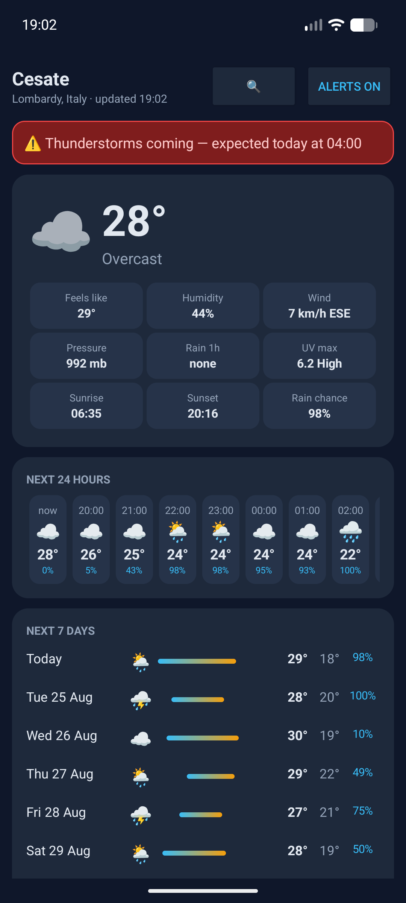

[](https://www.buymeacoffee.com/adegard)

# Meteo Cesate (Android)

Lightweight Kotlin weather app with worldwide city selection.
No ads, no cookies, no tracking. Single data source: [Open-Meteo](https://open-meteo.com) (free, no API key).

## Features
- Current conditions (temp, feels like, humidity, wind, pressure, UV, sunrise/sunset)
- Next 24 hours + 7-day forecast with min/max bars and rain chance
- 🌍 **Any city worldwide** — tap 🔍 and search (Open-Meteo geocoding)
- ⛈️ **Thunderstorm alerts**: high-priority notification when thunderstorms/hail are forecast within 12 h for your selected city (WorkManager check every 15 min, battery-friendly, Doze-aware)

## Screenshot

<p align="center">
  
</p>

## Download APK
Grab it from Release

## Install
1. Transfer the APK to your phone and allow "Install unknown apps"
2. Open the app → tap **Alerts ⛈️** to grant notification permission

## Build
```bash
./gradlew assembleDebug
```
CI (GitHub Actions) rebuilds automatically on every push to `main` and publishes the APK to the `status` branch.

## Privacy
The app talks only to `api.open-meteo.com` and `geocoding-api.open-meteo.com`.
No analytics, no ads SDKs, no cookies, no location permission — the selected city is stored locally on device.
